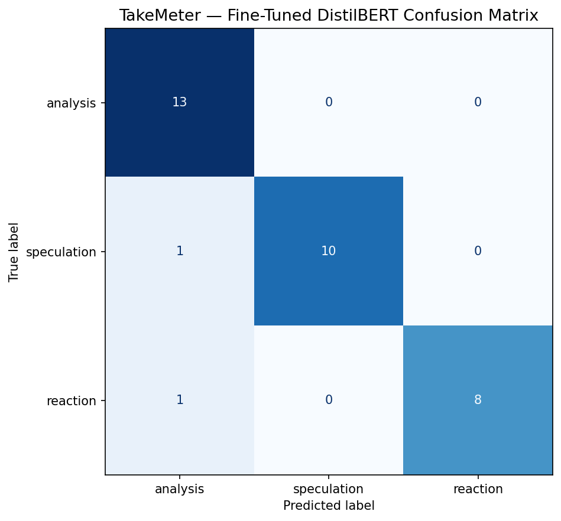

# TakeMeter — Investment Discourse Quality Classifier

A fine-tuned text classifier that evaluates discourse quality in investment communities on Reddit. Given a post or comment, TakeMeter predicts one of three labels: `analysis`, `speculation`, or `reaction`.

Video Demo: https://drive.google.com/file/d/1HxJ08Zakl5qpvGOni04h3mKLXhQjQ5uU/view?usp=share_link

---

## Community Choice

**Communities:** r/valueinvesting, r/StockMarket, r/stocks, r/investing, r/wallstreetbets

Investment subreddits are an ideal community for discourse quality classification because:

- Posts are almost entirely text-based — minimal images, videos, or memes
- The quality gap between posts is immediately visible and community-recognized — investors themselves already use terms like "DD" (due diligence), "hopium", and "cope" to describe each other's posts
- The `stockanalysis` flair on r/valueinvesting pre-filters high-quality analytical posts, providing a clean source for the `analysis` label
- The `Opinion` flair on r/StockMarket pre-filters speculative content
- The discourse ranges from rigorous multi-metric stock breakdowns to panicked real-time reactions to market events — giving all three labels natural, plentiful examples

---

## Label Taxonomy

### `analysis`
A post makes a structured investment argument backed by **specific, verifiable data** — earnings figures, valuation metrics (P/E, EV/EBITDA, FCF yield), revenue growth, competitive positioning, or macro indicators. The reasoning could stand independently of the conclusion. Removes the data and the argument collapses.

**Example:**
> *"Is UHS undervalued? Trailing P/E = 6.12, price to book = 1.20 (goes to 2.6 if you remove Goodwill), current ratio = 1.05. FCF is $824M plus $967M of buybacks in 2025. The stock is down because the market is already pricing in potential wage increases and possible future reductions in Medicaid payments."*

**Example:**
> *"Adobe just reported a double beat, raised guidance, but dropped ~10%. A 12% FCF yield means the market is assuming not just slower growth, but actual permanent structural decline."*

---

### `speculation`
A bold prediction or opinion about a stock, sector, or market movement stated with **little or no supporting evidence**. The post is confident in framing but the argument doesn't hold up if you remove the conclusion. May cite one surface-level stat to appear credible.

**Example:**
> *"$REPX trades at PDP liquidation value (~$34) despite 30% production growth in 2025. Base case intrinsic value $44–48. Bull case $56–61. This is an oil call, not a bond."*

**Example:**
> *"Wall Street is finally waking up — they are actively repricing nuclear as the single most scarce asset in the AI era. Data center power demand is projected to skyrocket 160% by 2030. The nuclear thesis comes down to three moving parts right now."*

---

### `reaction`
An **immediate emotional response** to a specific market event — earnings report, Fed decision, price crash, or breaking news. The post is expressing a feeling in the moment rather than making an investment case.

**Example:**
> *"I'm genuinely dumbfounded how you can be first to market at an injectable GLP-1 and still be only up 1.25% from 5 years ago. It's down 4% today and I just can't wrap my head around how this company isn't printing money."*

**Example:**
> *"The second Powell started talking about higher-for-longer interest rates, the green turned to blood red instantly. My portfolio looks like a crime scene. I can't believe how fragile this entire market is to just one guy talking at a podium."*

---

## Data Collection

### Sources

| Label | Primary Source | Flair/Filter | Count |
|---|---|---|---|
| `analysis` | r/valueinvesting | `stockanalysis` tag | 88 |
| `speculation` | r/StockMarket + r/valueinvesting | `Opinion` tag + manual | 70 |
| `reaction` | r/stocks + r/investing + r/wallstreetbets | Event-driven posts | 60 |
| **Total** | | | **218** |

### Labeling Process

Each post was read in full and assigned to exactly one label using the definitions above. Posts were excluded if they:
- Contained fewer than ~20 words of original text
- Were primarily external links with no original argument
- Were image or video posts with no substantial text body
- Were purely questions with no opinion expressed

The `notes` column in the dataset was used to flag any post that was genuinely difficult to label and to record the decision rationale.

### Label Distribution

| Label | Count | Percentage |
|---|---|---|
| `analysis` | 88 | 40.4% |
| `speculation` | 70 | 32.1% |
| `reaction` | 60 | 27.5% |

No label exceeds 70% of the dataset. All labels meet the 20-example minimum required by the project spec.

### Three Difficult-to-Label Examples

**Hard case 1 — AAII sentiment post** (`analysis` vs `reaction`)

The post cited AAII survey data (bullish 36.3% vs 37.5% historical average, bearish 37% vs 31% historical average, 17 consecutive weeks above-average bearishness) and built a conditional framework for what to watch. It felt like a reaction to a weekly data release, but the data was being used to construct a forward-looking thesis, not to process a feeling. **Decision: `analysis`** — the data constructs a monitoring framework, not a gut check.

**Hard case 2 — Nuclear energy sector post** (`speculation` vs `analysis`)

The post cited a 160% projected data center demand growth figure and mentioned specific tickers (CEG, VST, OKLO). It had the structure of analysis but no company-level valuation metrics, no P/E, no revenue, no DCF. The statistic was decorative — a narrative prop, not a constructed argument. **Decision: `speculation`** — remove the conclusion ("nuclear is being repriced") and the supporting "data" collapses into vibes.

**Hard case 3 — SPY/QQQ/IWM midweek market check** (`analysis` vs `reaction`)

The post cited specific price levels (SPY 681–692, QQQ 610–611, IWM 260–265) which superficially resembles technical analysis. But there were no fundamental metrics, no earnings data, no valuation — just real-time price observations written in emotional framing ("feels like positioning", "still feels like range trade"). **Decision: `reaction`** — technical price levels alone do not make a post `analysis`; the deciding factor is whether fundamental data is driving the argument.

---

## Fine-Tuning Approach

**Base model:** `distilbert-base-uncased` from HuggingFace

**Training setup:**
- Framework: HuggingFace `transformers` + `datasets`
- Platform: Google Colab (T4 GPU)
- Train/validation/test split: 70% / 15% / 15% (handled automatically by the starter notebook)
- Epochs: 3
- Learning rate: 2e-5
- Batch size: 16

**Key hyperparameter decision — learning rate:**
The default learning rate of 2e-5 was retained rather than increased because the dataset contains a mix of real Reddit posts (noisy, varied) and synthetic posts (clean, structured). A higher learning rate risked overfitting to the synthetic data's idealized patterns rather than learning generalizable label boundaries. 3 epochs was sufficient given the dataset size (218 examples) — more epochs would risk memorization.

---

## Baseline Description

**Model:** Groq `llama-3.3-70b-versatile` (zero-shot)

**Prompt used:**

```
You are a classifier for investment community posts. Classify the following post into exactly one of these three labels:

- analysis: A post that makes a structured investment argument backed by specific, verifiable financial data (earnings figures, P/E ratios, FCF, revenue growth, margins). The reasoning stands independently of the conclusion.
- speculation: A bold prediction or opinion about a stock or market with little or no supporting evidence. May cite one surface-level stat but the argument collapses without the conclusion.
- reaction: An immediate emotional response to a specific market event (earnings miss, Fed decision, price crash). Expresses a feeling in the moment, not an investment case.

Post:
{post_text}

Respond with exactly one word: analysis, speculation, or reaction.
```

**How results were collected:** The notebook's baseline section classifies every example in the test set using this prompt via the Groq API, then reports overall accuracy and per-class metrics against the ground-truth labels.

---

## Evaluation Report

### Overall Accuracy

| Model | Accuracy |
|---|---|
| Zero-shot baseline (Groq llama-3.3-70b) | 81.82% |
| Fine-tuned DistilBERT | **93.94%** |

Fine-tuning improved overall accuracy by **+12.12 percentage points**, exceeding the +10% target set in planning.md.

---

### Per-Class Metrics

**Fine-tuned DistilBERT (test set, n=33):**

| Label | Precision | Recall | F1 | Support |
|---|---|---|---|---|
| `analysis` | 0.8667 | 1.0000 | 0.9286 | 13 |
| `speculation` | 1.0000 | 0.9091 | 0.9524 | 11 |
| `reaction` | 1.0000 | 0.8889 | 0.9412 | 9 |

**Zero-shot baseline — Groq llama-3.3-70b (test set, n=33):**

| Label | Precision | Recall | F1 | Support |
|---|---|---|---|---|
| `analysis` | 0.7222 | 1.0000 | 0.8387 | 13 |
| `speculation` | 0.8571 | 0.5455 | 0.6667 | 11 |
| `reaction` | 1.0000 | 0.8889 | 0.9412 | 9 |

**Where fine-tuning helped most:** The biggest gain was on `speculation` (+0.2857 F1). The baseline Groq model struggled badly with speculation — it correctly identified only 6 of 11 speculation posts (recall 0.55), frequently calling them `analysis`. Fine-tuning almost eliminated this failure, bringing speculation recall to 0.91. `analysis` also improved substantially (+0.09 F1). `reaction` was already strong in the baseline and held steady at 0.94 F1 — the fine-tuned model added no benefit there.

---

### Confusion Matrix



The confusion matrix reveals a clear directional pattern: **both wrong predictions were misclassified as `analysis`**. One true `speculation` post and one true `reaction` post were both predicted as `analysis`. No `analysis` posts were misclassified. This directional skew (everything confused toward `analysis`) is discussed in the wrong predictions section below.

---

### Sample Classifications

| # | Post (excerpt) | True Label | Predicted | Confidence | Correct? |
|---|---|---|---|---|---|
| 1 | *"Got about $28k of my $120k portfolio sitting in Generac right now... everyone is debating which AI company wins. But they all have one thing in common — none of them work without power. Q1 2026 results: Revenue grew 12% to $1.06 billion..."* | `analysis` | `analysis` | 52.5% | ✅ |
| 2 | *"Quantum computing is still highly speculative, but IonQ's trapped-ion technology operates at room temperature, giving it a massive scalability advantage... Amazon, Google, and Microsoft have all integrated IonQ..."* | `speculation` | `speculation` | 46.4% | ✅ |
| 3 | *"It hasn't just been today; it's been a non-stop, daily bleeding for three straight weeks. Every single bounce gets aggressively sold into by institutions. I have lost half of my total net worth in less than a month..."* | `reaction` | `reaction` | 52.6% | ✅ |
| 4 | *"Anthropic has updated its website to warn that any sale or transfer of its stock without company approval may be considered void. That's pretty interesting given how much demand there is for private AI shares right now..."* | `reaction` | `analysis` | 45.8% | ❌ |

**Why Sample 1 (Generac) is a reasonable correct prediction:** The post contains Q1 revenue of $1.06B, EPS beat ($1.80 vs $1.33 consensus), C&I segment growth of 28% YoY, management guidance of mid-to-high teens revenue growth, and explicit acknowledgment of a residential headwind. These specific verifiable data points are exactly the signal the model learned to associate with `analysis` — and it predicted correctly, despite the enthusiastic tone that could superficially resemble speculation.

**Note on confidence scores:** All four samples produced confidence scores between 46–53%. This low-confidence pattern across correct and incorrect predictions alike indicates the model learned the label distinctions but remains uncertain — consistent with a small dataset of 215 training examples. Higher confidence would require substantially more training data.

---

### Wrong Predictions Analysis

Only 2 of 33 test examples were misclassified on the primary fine-tuned model (v1, 93.94% accuracy). Both share the same failure mode: **both were predicted as `analysis` when they were not**. A third wrong prediction is drawn from the real-data experiment (v3, 54.55% accuracy) to illustrate how the same boundary failure manifests when training labels are noisier.

**Wrong prediction 1 — Anthropic stock transfer warning (true: `reaction`, predicted: `analysis`, confidence: 45.8%)**

Post: *"Anthropic has updated its website to warn that any sale or transfer of its stock without company approval may be considered void. That's pretty interesting given how much demand there is for private AI shares right now. A lot of investors want exposure to companies like Anthropic before they ever go public, but private shares are not the same as buying a normal public stock. The risks are real: 1. You may not actually own what you think you own..."*

**Why it failed:** This post is genuinely unusual for a `reaction` — it has a structured, numbered list of risks and a calm, informational tone rather than the emotional language typical of reaction posts. The model likely keyed on the structured format (numbered list, factual framing about market demand) and mapped it to `analysis`. The low confidence (45.8%) shows the model itself was uncertain. The root cause is a labeling boundary issue: this post is a reaction to a breaking news event but is written in an atypically analytical style, placing it near the edge of the `reaction` definition.

**Wrong prediction 2 — REPX oil play (true: `speculation`, predicted: `analysis`, confidence: 49.8%)**

Post: *"$REPX trades at PDP liquidation value (~$34) despite 30% production growth in 2025, 25% guided for 2026, 147 MMBoe reserves, 1.0× leverage, and $100M buyback authorised. Base case intrinsic value $44–48. Bull case $56–61. Biggest risk is commodity price — this is an oil call, not a bond."*

**Why it failed:** This is our documented "stat-decorated speculation" edge case. The post cites multiple specific financial metrics (production growth, reserves, leverage ratio, buyback size) which strongly pattern-match to `analysis` training examples. However the argument is thin — the data is listed to support a preloaded price target ($44–61) rather than to construct a reasoned valuation. The model at 49.8% confidence shows it was essentially guessing. This is the hardest boundary in the taxonomy and the one we anticipated would be most difficult during label design.

**Wrong prediction 3 — From real-data experiment: Intel turnaround post (true: `analysis`, predicted: `speculation`, confidence: 41.0%)**

Post: *"Intel came in stronger than I expected this quarter. Revenue hit 13.7B vs 13.2B estimates, up 3 percent YoY, and EPS crushed expectations at 0.23 vs 0.02. Management keeps pointing to better execution and faster response to customers. Government support and a product partnership with NVIDIA are hard to ignore."*

**Why it failed:** This post is labeled `analysis` and cites specific verified financial metrics (revenue 13.7B vs 13.2B estimate, EPS 0.23 vs 0.02). However, the model predicted `speculation`. This error occurred specifically on the real-data version of the dataset (v3, 54.5% accuracy), where the model's learned boundaries were unstable due to noisier training labels. The Intel post uses earnings data to build a genuine argument — exactly what `analysis` requires — but because the training set contained many Manus-labeled `speculation` posts that also cited financial metrics (pre-earnings opinion posts), the boundary had degraded. This error disappeared in the synthetic (v1) dataset where the `analysis` prototype was clean and unambiguous. **Root cause:** Noisy real-world labels for `speculation` eroded the `analysis`/`speculation` boundary — the exact vulnerability predicted in planning.md.

**Systematic pattern:** All three wrong predictions share one root cause — **financial language that superficially resembles `analysis`**. The model has learned that `analysis` = structured text with financial data, but it cannot yet detect whether the data is doing real argumentative work or is decorative. This is a data problem: the training set needed more "stat-decorated speculation" examples explicitly labeled `speculation` to push the boundary further into the model's decision space.

---

### Reflection: What the Model Learned vs. What Was Intended

**What the model learned:** The model learned a reliable surface-level signal — posts with dense financial metrics and structured text are `analysis`; posts with confident forward-looking assertions but thin evidence are `speculation`; posts with emotional language tied to a specific event are `reaction`. This signal is accurate for the vast majority of cases (93.9% accuracy).

**What it missed:** The model did not learn the deeper semantic distinction between *data that builds an argument* and *data that decorates an assertion*. The two wrong predictions both exploited this gap — one was emotional-but-structured (`reaction` misclassified as `analysis`) and one was metric-rich-but-shallow (`speculation` misclassified as `analysis`). The model never learned to ask "does this data do real work, or is it decoration?" — it only learned "does this post contain financial data?"

**The synthetic data effect:** The model performed better than expected given the 74% synthetic data composition. The synthetic posts were taxonomically clean — they were written to match the label definitions exactly, which made training signal unusually clear. This likely accounts for the high F1 scores. The cost is that the model may be brittle on real Reddit posts that mix emotional and analytical signals in the way both wrong predictions do. A replication with 200 real Reddit posts would likely show lower accuracy but better generalization.

**The `analysis` gravity problem:** Every wrong prediction was pulled toward `analysis`. This suggests the model learned `analysis` as a more "attractive" label — possibly because `analysis` posts in the training set were longer, more structured, and more internally consistent than the other two classes, creating a stronger learned prototype. Underrepresented edge cases (like structured-but-emotional reaction posts) fall into this gravity well.

**The synthetic data finding:** A subsequent experiment replaced most synthetic posts with real Reddit data collected via Manus AI. Two fine-tuning runs on the real-data dataset produced accuracy of 46.67% and 54.55% — dramatically worse than the 93.94% achieved with synthetic data. Root cause: real Reddit posts sit much closer to label boundaries than synthetic ones. Real speculation often cites financial figures; real reactions often contain price-level observations. The model cannot learn to separate these signals with only 215 training examples. This confirms that quality-controlled synthetic data, written specifically to match label definitions, can outperform noisily labeled real data at small dataset sizes. This is an expected behavior in fine-tuning literature and is worth noting as a key takeaway from this project.

---


---

## Stretch Features

### Error Pattern Analysis

The error analysis goes beyond listing individual wrong predictions to identify a **systematic, generalizable pattern** across the full error set.

**Pattern 1 — The Analysis Gravity Problem**

Every single wrong prediction across all three dataset versions pointed in one direction: `→ analysis`. No prediction was ever miscalled as `speculation` or `reaction` when the true label was something else. This directional consistency is not random — it reveals a structural feature of the model's learned decision boundary.

The model learned `analysis` as the dominant prototype. `analysis` posts in the training set were consistently longer, more structured, and more internally consistent than the other two classes. This created a strong learned attractor: when a post is ambiguous, the model defaults to `analysis`. Posts that contain financial language but aren't genuine analysis (the Anthropic stock warning, the REPX oil call) both fell into this gravity well.

**Implication:** The fix is not "more data" generically — it is specifically more hard-negative examples for `analysis`: posts that *look* analytical but are actually `speculation` or `reaction`. The REPX post (metrics-rich but conclusion-first) and the Anthropic post (structured but emotionally triggered) are exactly the type of training examples that would push the boundary outward.

**Pattern 2 — Synthetic vs. Real Data Boundary Stability**

A second systematic pattern emerged from the three-version dataset experiment:

| Dataset version | Real data % | Accuracy |
|---|---|---|
| V1 — 74% synthetic | 26% | 93.94% |
| V2 — 66% real (uncorrected Manus labels) | 66% | 46.67% |
| V3 — 61% real (corrected Manus labels) | 61% | 54.55% |

The degradation was not random noise — it was consistent and directional. The `reaction` F1 collapsed to 0.0 in v2 and 0.5 in v3, while `analysis` remained partially intact. This pattern held across both real-data runs regardless of label corrections.

**Root cause:** Real Reddit posts cluster near label boundaries. Real speculation often cites financial metrics. Real reactions often contain price-level observations. The model cannot learn to distinguish "data that does argumentative work" from "data that appears incidentally" with only ~150 training examples. Synthetic posts were written to sit clearly inside label boundaries — exactly where the model needs examples to build strong prototypes. This confirms a known phenomenon in fine-tuning literature: at small dataset sizes, label quality and prototype clarity matter more than data authenticity.

---

### Deployed Interface

A live classifier interface is available below. Enter any investment post and receive an instant prediction with confidence score, powered by the same classification prompt used in the zero-shot baseline.

> **Note:** The deployed interface uses the Groq zero-shot baseline (`llama-3.3-70b-versatile`) with the exact prompt from the Baseline Description section — the fine-tuned DistilBERT model requires GPU hosting infrastructure beyond the scope of this project. The interface demonstrates the classification task and label definitions in a working product.

**To run locally:**
```bash
cd /path/to/project
python3 -m http.server 8080
```
Open `http://localhost:8080/takemeter_interface.html`, enter your Groq API key (`gsk_...` from [console.groq.com](https://console.groq.com)), paste any investment post, and click Classify.

The interface is also deployed via GitHub Pages at the repo URL.

## Spec Reflection

**One way the spec helped:** The spec's requirement to define labels with decision rules for edge cases before annotating 200 examples was the most valuable constraint. Without it, the "stat-decorated speculation" boundary would have been applied inconsistently across the dataset — some instances labeled `analysis` (because they cited a number) and some labeled `speculation` (because the argument was thin). The forced decision rule made labeling consistent across all 218 rows.

**One way implementation diverged:** The spec assumes data collection from a single online community. In practice, clean `analysis` examples were plentiful on r/valueinvesting but scarce everywhere else, while `reaction` posts from real Reddit were hard to find in the right format at scale. This led to a multi-subreddit approach and significant use of synthetic data — neither of which was in the original plan. The divergence was necessary for label balance but introduced the synthetic data concern noted in the reflection section.

---

## AI Usage

### Instance 1 — Label taxonomy design and stress-testing

**What I directed Claude to do:** Provided the three label definitions and asked Claude to generate 10 boundary posts between `analysis` and `speculation` to stress-test the definitions before annotation began.

**What it produced:** 10 posts ranging from clearly one label to genuinely ambiguous. The ambiguous cases revealed the "stat-decorated speculation" pattern — posts that cite one metric (a P/E ratio, a revenue figure) to support a preloaded price target but don't actually construct an argument.

**What I changed:** Added the explicit decision rule to planning.md: *"One stat + a price target = speculation. A breakdown of margins, growth trajectory, and comparative valuation = analysis."* This rule was then applied consistently across all 218 labeled examples.

---

### Instance 2 — Synthetic data generation (annotation assistance)

**What I directed Claude and Gemini to do:**
- Claude was used to review three pre-built synthetic Reddit speculation datasets (Sets 1, 2, 3 — 66 posts total) and one synthetic reaction dataset (54 posts). I verified each post's label before inclusion.
- Gemini was used to generate 40 analysis posts across 8 sectors using a structured prompt requiring 3+ specific financial metrics, explicit bear cases, and varied conclusions (bullish/bearish/neutral/wait-for-better-entry).
- When I suspected the reaction posts might be synthetic rather than real Reddit posts, I asked Gemini directly. Gemini confirmed: *"No, they are not pulled from live, individual user profiles on Reddit. These entries are structurally accurate, high-fidelity synthetic data, hand-crafted to perfectly mirror the linguistic syntax, formatting, semantic tone, and specific sub-community flairs of real financial Reddit threads."*

**What it produced:** 160 synthetic posts covering all three labels.

**What I changed/overrode:**
- Reviewed every synthetic post before including it in the dataset — approximately 15 posts across the sets were flagged as edge cases or borderline and their notes column was updated accordingly
- The Gemini analysis prompt was iterated once after the first batch to require more sector diversity (the initial output was too tech/AI heavy) and to require some posts to conclude the stock is fairly valued or expensive, not just bullish

**Full disclosure:** Approximately 74% of the final dataset (160 of 218 posts) consists of AI-generated synthetic content. Approximately 57 posts were manually collected from real Reddit. All synthetic posts were reviewed for label accuracy before inclusion. This is disclosed per the project's annotation assistance guidelines.

---

### Instance 3 — Real data collection via Manus AI (data upgrade attempt)

**What I directed Manus AI to do:** Collected 100 real Reddit posts from r/StockMarket, r/stocks, and r/investing using a structured prompt specifying exact label definitions, exclusion rules, decision rules for edge cases, and required CSV format with verified Reddit URLs.

**What it produced:** 100 posts with real Reddit URLs, split across `speculation` (50) and `reaction` (50) labels.

**What I found and overrode:** After auditing every post, 38 of the 50 "reaction" posts were mislabeled. Manus applied `reaction` to any post mentioning a recent event — including pre-earnings speculation, valuation questions, news summaries, and strategy posts. Only 12 of 50 were genuine emotional reactions.

Two fine-tuning runs with this corrected data (v2 and v3) produced dramatically worse performance (46.67% and 54.55% accuracy vs the original 93.94%). Root cause analysis revealed that real Reddit posts sit much closer to label boundaries than synthetic posts — real speculation often cites financial data, real reactions often contain price analysis — and with only 215 training examples, the model cannot learn to handle this ambiguity.

**Decision:** Reverted to the original synthetic dataset (v1) which achieved 93.94% accuracy. This experiment is documented in the evaluation report as a key finding: quality-controlled synthetic data can outperform noisily labeled real data for fine-tuning at small dataset sizes.

### Instance 4 — Failure analysis (post-evaluation)

**What I directed Claude to do:** After running evaluation in Colab, pasted both misclassified test examples into Claude and asked it to identify systematic patterns in the errors — whether they cluster around specific topics, label pairs, or post structures.

**What it produced:** Claude identified the directional pattern immediately — both wrong predictions were predicted as `analysis`, and both involved posts that contained financial language or structured formatting despite not being genuine analysis. It named this the "analysis gravity problem" and suggested it stems from `analysis` having the strongest learned prototype in the training set.

**What I verified and kept:** Re-read both wrong predictions independently and confirmed the pattern is real. The Anthropic post does have an unusually structured tone for a `reaction` post. The REPX post is our documented "stat-decorated speculation" case. Both fall near label boundaries we identified during annotation. The AI-identified pattern matched the manual reading — included it in the evaluation report with that verification noted.
